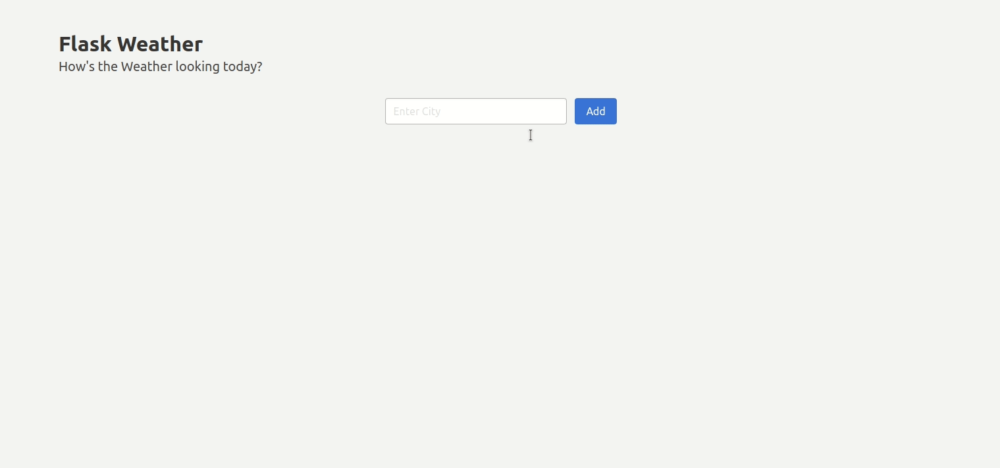

## Flask Weather WebApp

1️⃣ My _first_ Flask app  
⛅ Built using **_OpenWeather_** API  
🚀 Hosted on **_Heroku_**  
❄️ Used _Bulma CSS_ for Front-End

[Live version of the app](https://flask-weather-web-app.herokuapp.com)

You can _Add Muliple Cities, Delete Cities, see their Currnet Weather_

requirements.txt    
* Flask
* requests
* Flask-SQLAlchemy
* python-dotenv
* gunicorn [for hosting on heroku]
